## Introduction

Hello. I am Soarance. You may have seen me around in some trading discords, exchanging ideas, posting my weird graphs of my newest algorithm performance, etc. I know this is a long document, but you have my word that I didn't use AI to write any of this. I don't like using AI for things like documentation, so yeah…

The reason I am writing this document is that far too often I see people posting in Discord, Reddit, Youtube, any social media, about their shiny new trading algorithm that they developed recently. Sometimes it is to brag about the thing they spent maybe 5 minutes writing using ChatGPT, but more dangerously, sometimes they are selling it, or using it as propaganda to show people that their trading strategy works. Oh and to get their trading course or signals, you have to pay $100 per month. This doesn't include indicators, but I could write an entire book about how I don't like people selling those either.

Here is the hard truth: even in the world of automated trading, there is no silver bullet. Even disregarding the time it takes to learn the statistical knowledge required for proper strategy testing, creating algorithms itself is a long and tedious process. Weeks turn into months, and months turn into years. As a result, the people who do have a working strategy will almost never share or sell it. Well, not never. I have seen some people selling legitimate strategies, but they are rare and I wouldn't get my hopes up.

I got tired of seeing people get scammed. So I wrote this document to hopefully share it around and make people more educated about how to spot a good algorithm vs a bad one. It's actually fairly obvious once you get the hang of it. And spoiler alert, most algorithms advertised out there are bad. More often than not, the people selling their useless bots don't know themselves why their algorithms are bad. So in other words, they themselves will often truly believe their own algorithm works; so I hesitate to call them the bad guys here. Though undeniably, some are aware and are doing it out of malicious intent.

If you read up to this point and decided you don't need to read any further and to just not trust people advertising their algorithms, then that's good, no need to read on. But if you're interested in how to have a keen eye for them, read on, my fellow curious paddlewon.

## Chapter 1: Why Algorithms Fail

The first thing people think that determines if a strategy works or not, is to just backtest it over a period of time. If it looks good, then it's good to go, right?! WRONG!! The image you're seeing posted by the person selling their algorithm is likely not photoshopped. It's a genuine backtest over a period of time. So why does it fail? If it worked over the last 5 years, why wouldn't it work now? Well, my friend, there's a concept called "overfitting", often also known as "curve fitting".

Overfitting is when you fit your strategy too well to the backtesting data, that you end up capturing noise instead of a real market edge. It happens when proper optimization practices aren't followed when developing your algorithm. In other words, if you don't already know the techniques to minimize overfitting risk, you almost are certain to be writing an overfitting algo. In fact, overfitting is the number one mistake done by even professional algo writers. It's a silent killer.

I also had difficulty wrapping my head around this concept when I first started writing algorithms. In fact, I could go on and on about why and how overfitting happens, and why it's not as crazy of a concept as it first seems. But that could probably fit in its own separate document. For now, you just gotta trust me. OVERFITTING DESTROYS STRATEGIES.

So you may be wondering, if these strategies I'm seeing online are overfit, what happens? Excellent question.

Here is a nice visualization of what generally happens.

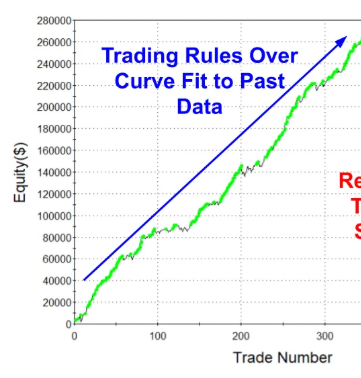

As you can see, if you look at the strategy from around trade count 350, it looks quite good, doesn't it? The curve is a constant upslope, and you're making fantastic money. By now you may have noticed that I chopped a part of the graph off, and you'd be right. Here is how the strategy played out over the next 50 trades:

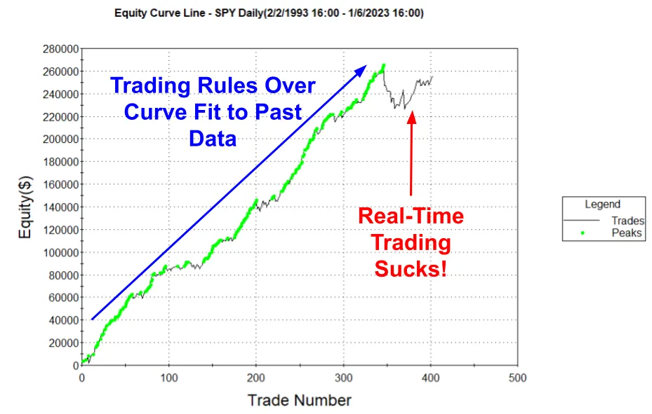

What happened? Our strategy looked so good up until we started live trading it! What are the chances that the turning point is literally right when we started using it?? Well, that's actually exactly how overfitting works. It's precisely because all the data we used to make the strategy was in the past. You don't have to understand why this happens, just that it does.

Now that we know why strategies fail, and why spending your money on a strategy that someone advertised on Discord is a bad idea, let's proceed onwards to the section on how to spot a bad trading bot.

## Chapter 2: Spotting a Bad Algorithm

I'll be splitting this section into multiple parts, due to the fact that there are so many things to look out for. To be clear, this is not a comprehensive list. But you can apply these to almost any trading algo you see online, and if it fails even 1 of them, the strategy is likely bad. Got it? All right, let's gooooo.

### Chapter 2A: Backtest Equity Curve Timespan is Too Short

The first thing to look out for: the backtest equity curve that they show is too short in its time range. The reason it's short is because the strategy sucks if applied to a larger time frame. I'm not saying that good algos have to work in every single regime in history, but it should at least be applicable to a long enough time window to be effective. Here is an example of a backtest screenshot that was shared by someone selling the algorithm in a real Discord channel:

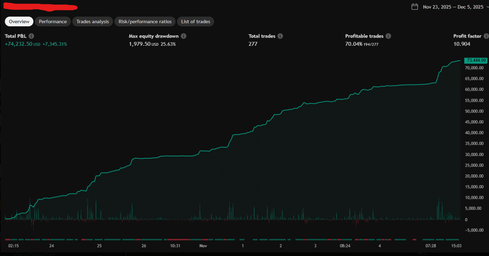

If you happen to be the person who is selling this algorithm, I am sorry that I used you as an example LOL. Hey, at least I blurred out the strategy title so people don't know it's you. But regardless, shame on you.

We're going to use this algorithm as a prime example of a bad trading bot. The first thing to notice here is that the backtest window here is… wait for it… a whopping 2 weeks. That's so insanely short, considering TradingView has multiple years of backtesting data available. So the question now becomes, why don't you just click twice on the date range on the top right corner, and show everyone how your strategy is when testing further back? 2 weeks isn't even one of the default ranges they give you, you had to manually select the dates yourself. Why not give full transparency to those who are considering buying your algorithm? The answer is simple: these people don't want to be transparent. They purposely cherry pick their algorithm to show a specific window of time, to make it appear so much better than it actually is. Let me give you an example.

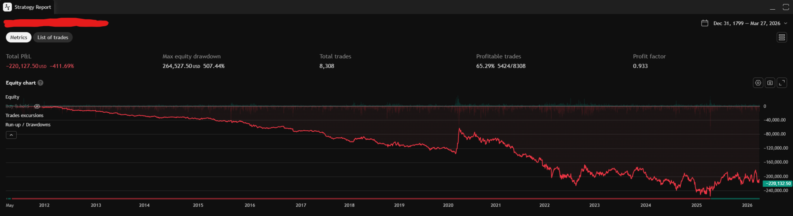

This strategy clearly sucks. It's losing throughout all of history. But let's see what happens if I do a little window-adjustment magic, specifically to the date range April 7, 2025 to July 28, 2025.

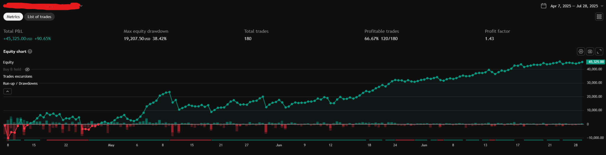

Holy balony! This strategy is suddenly SO GOOD! It will make you millions! And for the small price of $150 per month, you can have access to it NOW!!

Jokes aside, this was a date range of almost 4 months. That previous strategy I showed was a range of 2 WEEKS. Just think of how much cherry picking you could do if you weren't showing more than just 2 weeks of data.

Perhaps when confronted, they will say something like "i dOnT hAvE tRaDiNgViEw PrEmIuM", in which my response would be, then show us your backtest results you did in python, or whatever platform or IDE you did your tests on. If they said they only did it in TradingView, then automatically the algorithm is illegitimate. That's because the statistical tests required to show that a strategy isn't overfit can't be done on TradingView, and those tests are a requirement for any good algorithm.

That's not saying that narrowing the window is always a bad thing. Some strategies are regime specific. In fact, many algorithms only start coming to life after around 2018-2020. So narrowing it to show 2018 onwards, for example, isn't necessarily bad.

So that begs the question, how much should they show you for it to be legitimate? There's no one answer to this question. It often depends on the strategy. But I would say as a ground rule, at the very least, 4 years of data. And it can't just be any 4 years, it has to be specifically the last 4 years up until now. Maybe if someone showed me 3 years, I could give them a pass, but I'd have to erase my suspicions with the other items on this list, which brings us to the next thing to look out for…

### Chapter 2B: The Backtest Looks Too Good

There's a well-known rule out there. If it looks too good to be true, it probably is too good to be true, and that applies to trading bots as well.

Let's look at our little example again.

You're telling me, you developed a strategy that has a win rate of 70%, and a profit factor of 10.9?????????????????????????????????????????

This is either cherry picked, overfit, future leaking, or repainting.

We already covered the first two, so what are the other two?

Future leaking is when the algorithm has access to information that, at the time of execution, doesn't yet exist. This is a common trap that many new algorithm developers often encounter. When you have historical data separated out into bars (depending on the timeframe you have), it's easy to look at an indicator that is calculated on the current bar's close, but you developed your strategy to enter on that bar, so it had access to future data. It's incredibly easy to do, and even if you tell ChatGPT to avoid future leaking when coding your algorithm, it often still does sometimes… that's how easy it is to leak future data. It gives your algorithm unrealistic results that can never be applied to live runs.

Repainting is when you tell your algorithm to go back in time and change its trade history. While not as easy to commit compared to future leaking, some people do it to maliciously make their algorithm look incredibly good. Needless to say, in real time you won't be able to time travel into the past to change your trade, so… yeah…

Anyway, an algorithm that looks too good to be true will often fall into one of those four categories, with overfitting being the most likely. So now the question is, how good is "too good to be true"?

Again, it depends on the algorithm. But as a general rule of thumb, if something has a profit factor above 1.6, I start getting suspicious. If it has a profit factor above 2.0, I almost immediately dismiss it without even considering the possibility of legitimacy. Does that mean no trading bot could have a profit factor above 2.0? Of course not. But I doubt someone with a trading bot that good would be willing to share it for a humble price of $100 per month. It just doesn't happen.

You can find the profit factor on the top right of the equity curve, so look out for that number.

### Chapter 2C: The Equity Curve is Too Smooth

Here is a strategy someone shared on Reddit:

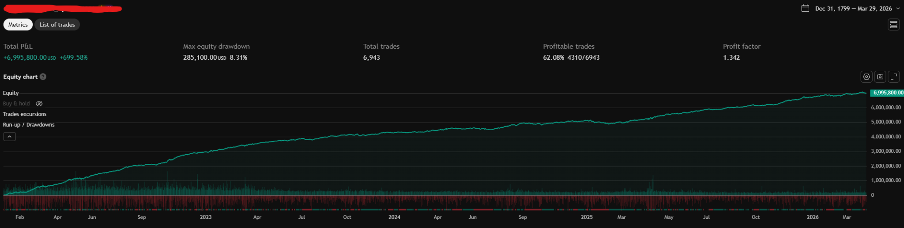

Hmmmmmm wow, that's just an incredibly smooth curve. Way too suspicious. A real strategy would have ups and downs. In fact, one of the things we look out for when developing a trading algorithm is how much drawdown it has. We measure the max drawdown, Sharpe Ratio, etc. So getting a strategy that has almost no significant drawdown is way too suspicious. Often times, this is the result of any of the 4 factors I listed above. In this specific case, The OP even responded to me, admitting some flaws…

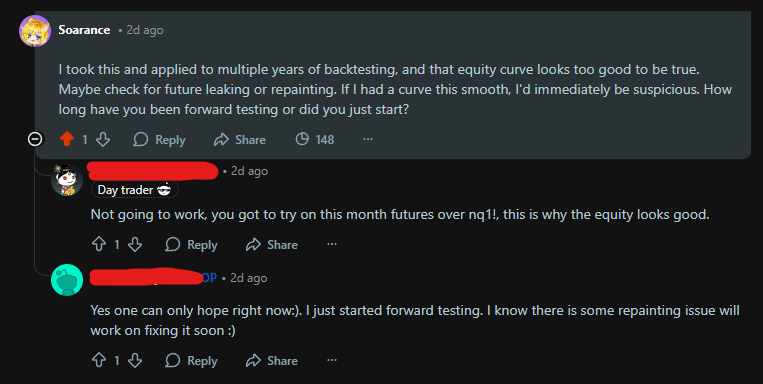

Ignore that first reply, they have no idea what they're talking about lol.

Looks like the issue here was repainting. Considering that OP admitted to it, they didn't seem to have done it on purpose. I'm willing to bet that once they fix the repainting issue, their algorithm will fall apart. But as of the writing of this post, they haven't given an update. Fixing repainting isn't difficult, so I assume that after the fix, they were left with nothing but trash. It's unfortunate, but it is what it is.

Here is another example from a different Reddit post:

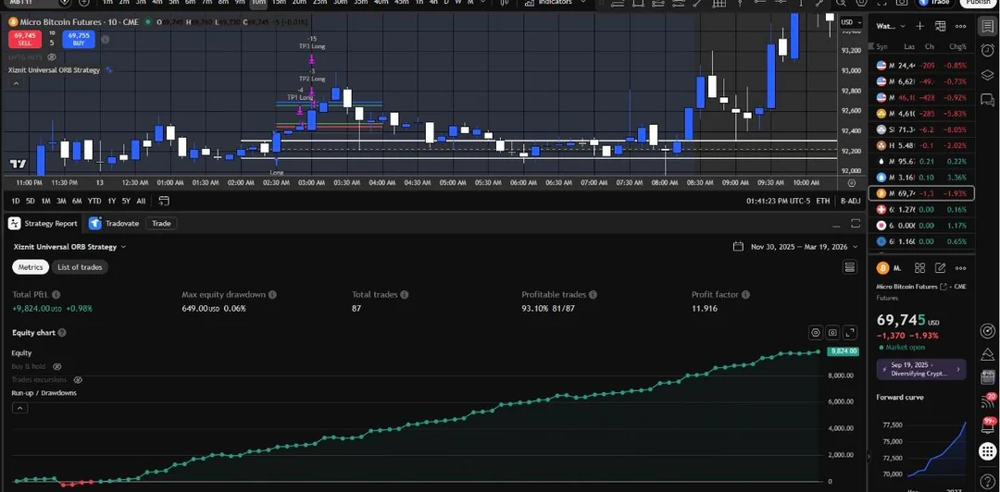

So now the question is, what does a realistic equity curve look like? How smooth is too smooth, and how rough is too rough? Well… that's impossible to answer with words alone, so instead, here is a screenshot of a more realistic strategy that was developed by yours truly (me).

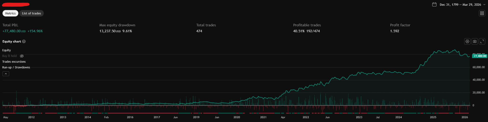

This algorithm is by no means perfect, but you can kind of see how it has ups and downs. The path is kind of rigid, and more importantly, it has drawdown. If you see anything worse than this, it's likely legit. Some strategies also have larger downtrends, especially during covid and the 2022 mini recession. Look out for those.

### Chapter 2D: One Size Fits All

The reality is, people making money from solely using automatic trading, won't be using just one. It's impossible to get something that fits all purposes in life and all your needs. Real algorithms will do well sometimes, badly on other times, which is why reevaluating your algorithms every few months is almost a requirement for any serious algo developer.

So then, as a result, it's important to have multiple algorithms that are run at the same time, with some swapping in and out depending on regime and other factors. If someone is claiming they are using one single algorithm because it just always makes them money, they are likely lying, or ignorant after running their algorithm for only 1 week or something. Realistically, professionals are always running potential algorithms on the side, forward testing, swapping algorithms in and out of their portfolio as they develop and evaluate more, etc.

As a result, I would say, if you really want to pay for someone's algorithm, unless their subscription comes with multiple algorithms that they themselves utilize, you shouldn't bother. I'd say at least 6-7 would be enough, but more is better. Heh, 67 (sorry).

### Chapter 2E: Unknowledgable

Algorithms take a ton of effort to make. It requires some coding skills, statistical knowledge, and a lot of time. While many discretionary traders take years to develop the ability to trade consistently, algo developers also take years to get consistent at developing and using algorithms. I myself am by no means an expert, but I spent a lot of time restudying statistics from my Master's degree, reading books, reading papers, watching Youtube, asking experts, etc. Developing a trading bot that works requires a lot of knowledge. So whenever you're unsure, simply asking the creator can reveal a lot. Here are some questions I like to ask.

**Q: Have you done Monte Carlo or permutation tests on your out-of-sample results?**

If they have no idea what a Monte Carlo simulation is, the algorithm they're selling is automatically trash.

**Q: What is the Sharpe Ratio / Drawdown like?**

It's easy for someone to google Sharpe Ratio, but if they don't know why it's important (or dismiss the question as being "unimportant"), then the algorithm is trash.

**Q: How did you run your optimization process?**

You're looking for an answer such as "Walkforward Fold Optimization", or at least a mention of train/test, in-sample and out-of-sample split. If they don't know what those are, or didn't do any data splitting, the algorithm is trash.

Note: a lot of people, when confronted with questions like these and don't know how to answer, will often just ask AI to give them an automated response. I have seen this happen multiple times now. They will delay their responses, and they come instantly without the "X is typing", indicating that they copied and pasted a ton of text. You can also tell if their grammar and texting style changes. Here's an example of a conversation I had in a discord where the owners are selling a trading bot. I wasn't going to include this, but I guess it's funny enough that I got tempted to sharing it.

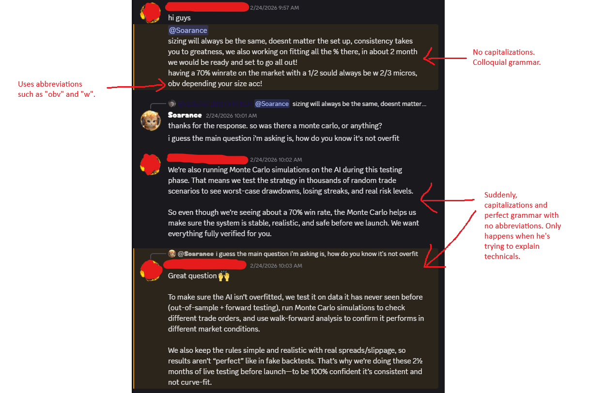

The change in grammar and talking style is already enough for me to know your algorithm isn't good. If you can't even have a normal human conversation on your work, and instead rely on AI to do your talking, then we're already done.

If you're curious, the conversation continued like this:

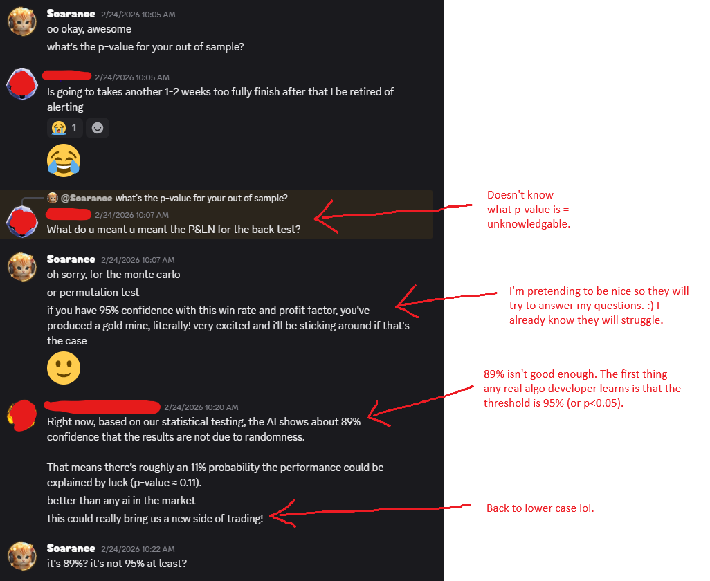

He then argues with me a bit on the confidence interval, and he is clearly wrong. That's another sign.

Finally, he sends me a screenshot of supposedly "a whole month forward tested solely by the bot itself without human intervention".

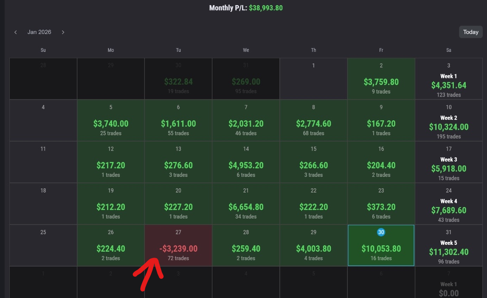

Needless to say, no algorithm is going to be A) THAT successful, and B) tilt trade one day with 72 trades (red arrow). That one day looks to me like a human trader on tilt if you ask me. No real algo will have this many trade count inconsistencies.

## Chapter 3: Conclusion

Hopefully, with this knowledge you are now equipped to sniff out the algorithm quality now. The thing is, the trading community is often very toxic, full of empty promises, scams, fake hype, etc, and algorithms are no exception. I used to be the victim in this before I extensively taught myself. But we all start somewhere. I still remember the first algo I wrote: a hidden divergence strategy that beat the s&p500 by almost 3x. I spent the rest of my day daydreaming about becoming rich. And then it turns out it was future leaking. After that, I was mesmerized by various algorithms people showed online. I even paid for one LOL. But it was all a learning experience; and to prevent people from wasting their money or getting scammed, I decided to write this guide so that others don't fall victim like I did.

If you made it this far, thank you for reading, and I hope you will share your knowledge around to others as you continue your trading journey. Just remember, there is no shortcut to becoming profitable, and buying an algorithm someone else spent 2 minutes making with ChatGPT is certainly not an exception.

---

*Written by Soarance, your friendly trading neighbor*
